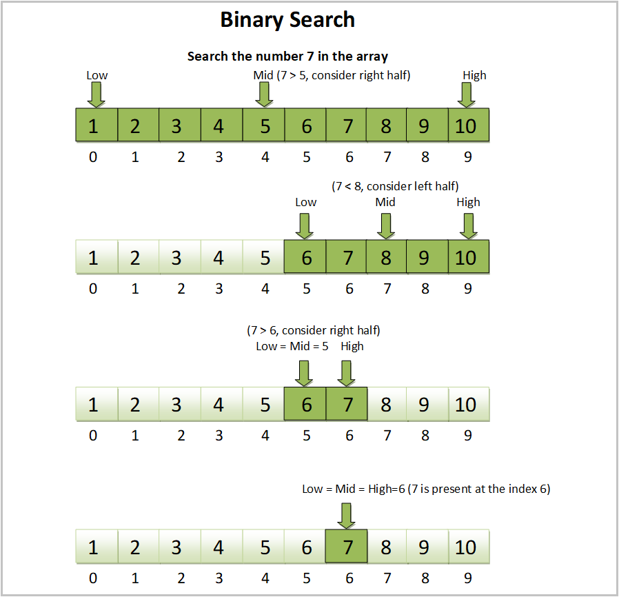

# Lecture-27 Binary Search in C Programming 

## Binary Search

**Binary Search is a search algorithm that is used to find the position of an element in a sorted array.**
<br>

**💻Example 1 :**

```c
#include <stdio.h>

int main() {
   int arr[] = {1, 5, 4, 7, 45, 23, 56};
   
   int key = 56;
   
   for(int i=0; i<7; i++)
   {
       if(arr[i]==key)
       {
           printf("Element found at %d",i);
           break;
       }
   }
    
    return 0;
}

```
**⚙️ Output :** 
>Element found at 6

<br>

### *Binary means (divide and conquer)*

* Bi   => Two
* n    => n
* ary  => array

<br>

**RULE**

* Data should be sorted


**FORMULA**

* mid = (start+end)/2 
* end=mid-1
* start=mid+1
* (start+end)/2

<br>

<p align="center">
  
</p>

**💻Example 2 :**

```c
#include <stdio.h>

int main() {
   int arr[] = {1, 2, 5, 7, 9, 12, 17, 22, 25, 30};
   
   int key = 25;
   int start = 0;
   int end = 9;
   
   while(start<=end)
   {
       int mid = (start+end)/2;
        if(arr[mid]==key)
        {
            printf("Element found at %d", mid);
            break;
        }
        else if(key>arr[mid])
        {
            start = mid + 1;
        }
        else
        {
            end = mid -1;
        }
   }
    
    return 0;
}
```
**⚙️ Output :** 
>Element found at 8

**🏠Homework**

## 🔗 Some Useful Links
https://www.cs.usfca.edu/~galles/visualization/Search.html

## 📖 References